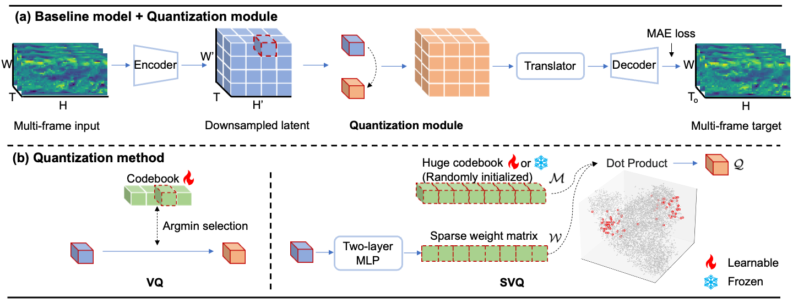

# SVQ: Sparse Vector Quantization for Spatiotemporal Forecasting

This repository contains the implementation code for [Paper](https://arxiv.org/abs/2312.03406):

**SVQ: Sparse Vector Quantization for Spatiotemporal Forecasting**

Chao Chen, Tian Zhou, Yanjun Zhao, Hui Liu, Liang Sun, Rong Jin.

## Introduction
<p align="center">
     <br>
</p>

Spatiotemporal forecasting tasks, such as weather forecasting and traffic prediction, offer significant societal benefits. These tasks can be effectively approached as image forecasting problems using computer vision models. Vector quantization (VQ) is a well-known method for discrete representation that improves the latent space, leading to enhanced generalization and transfer learning capabilities. One of the main challenges in using VQ for spatiotemporal forecasting is how to balance between keeping enough details and removing noises  from the original patterns for better generalization. We address this challenge by developing sparse vector quantization, or **SVQ** for short, that leverages sparse regression to make better trade-off between the two objectives. The main innovation of this work is to approximate sparse regression by a two-layer MLP and a randomly fixed or learnable matrix, dramatically improving its computational efficiency. 

Through experiments conducted on diverse datasets in multiple fields including weather forecasting, traffic flow prediction, and video forecasting, we unequivocally demonstrate that our proposed method consistently enhances the performance of base models and achieves state-of-the-art results across all benchmarks.

## Overview

This repository is developed based on [OpenSTL](https://github.com/chengtan9907/OpenSTL). We plug the proposed SVQ module in [SimVP](https://github.com/A4Bio/SimVP-Simpler-yet-Better-Video-Prediction).

* `openstl/modules/quantization_modules.py` contains implementation of SVQ and other exisitng VQ methods.
* `openstl/models/simvpvq_model.py` contains the SimVP+VQ model.
* `openstl/methods/simvpvq.py` contains core file for training and inference.

## Install

The environment can be easily reproduced using the following commands:

```
conda create -n svq python=3.10
conda activate svq
pip install torch==1.12.1+cu116 torchvision==0.13.1+cu116 torchaudio==0.12.1 --extra-index-url https://download.pytorch.org/whl/cu116
pip install -e .
pip install vector-quantize-pytorch geos basemap pyproj dill==0.2.7.1 einops seaborn
```

Please refer to [OpenSTL project](https://github.com/chengtan9907/OpenSTL) to download datasets. We use WeatherBench (weather), Human3.6M (human pose), KTH (human action), KittiCaltech (driving scene), and TaxiBJ (traffic) in our paper.

## Getting Started

### WeatherBench-S Temperature

```
python tools/train.py --overwrite -d weather_t2m_5_625 --res_dir work_dirs/weather_t2m_5_625  -c configs/weather/t2m_5_625/SimVPVQ_gSTA_learnable.py
python tools/train.py --overwrite -d weather_t2m_5_625 --res_dir work_dirs/weather_t2m_5_625  -c configs/weather/t2m_5_625/SimVPVQ_gSTA_frozen.py
```

### WeatherBench-S Humidity

```
python tools/train.py --overwrite -d weather_r_5_625 --res_dir work_dirs/weather_r_5_625  -c configs/weather/r_5_625/SimVPVQ_Swin_learnable.py
python tools/train.py --overwrite -d weather_r_5_625 --res_dir work_dirs/weather_r_5_625  -c configs/weather/r_5_625/SimVPVQ_Swin_frozen.py
```

### WeatherBench-S Wind Component

```
python tools/train.py --overwrite -d weather_uv10_5_625 --res_dir work_dirs/weather_uv10_5_625  -c configs/weather/uv10_5_625/SimVPVQ_Swin_learnable.py
python tools/train.py --overwrite -d weather_uv10_5_625 --res_dir work_dirs/weather_uv10_5_625  -c configs/weather/uv10_5_625/SimVPVQ_Swin_frozen.py
```

### WeatherBench-S Total Cloud Cover

```
python tools/train.py --overwrite -d weather_tcc_5_625 --res_dir work_dirs/weather_tcc_5_625  -c configs/weather/tcc_5_625/SimVPVQ_gSTA_learnable.py
python tools/train.py --overwrite -d weather_tcc_5_625 --res_dir work_dirs/weather_tcc_5_625  -c configs/weather/tcc_5_625/SimVPVQ_gSTA_frozen.py
```

### WeatherBench-M

```
python tools/train.py --overwrite -d weather_mv_4_4_s6_5_625 --res_dir work_dirs/weather_mv_4_s6_5_625  -c configs/weather/mv_4_s6_5_625/SimVPVQ_MogaNet_learnable.py
python tools/train.py --overwrite -d weather_mv_4_4_s6_5_625 --res_dir work_dirs/weather_mv_4_s6_5_625  -c configs/weather/mv_4_s6_5_625/SimVPVQ_MogaNet_frozen.py
```

### KTH

```
PORT=29001 CUDA_VISIBLE_DEVICES=0,1,2,3 bash tools/dist_train.sh configs/kth/simvp/SimVPVQ_IncepU_learnable.py 4 -d kth --res_dir work_dirs/kth
PORT=29001 CUDA_VISIBLE_DEVICES=0,1,2,3 bash tools/dist_train.sh configs/kth/simvp/SimVPVQ_IncepU_frozen.py 4 -d kth --res_dir work_dirs/kth
```

### KittiCaltech

```
PORT=29001 CUDA_VISIBLE_DEVICES=0,1,2,3 bash tools/dist_train.sh configs/kitticaltech/simvp/SimVPVQ_gSTA_learnable.py 4 -d kitticaltech --res_dir work_dirs/kitticaltech
PORT=29001 CUDA_VISIBLE_DEVICES=0,1,2,3 bash tools/dist_train.sh configs/kitticaltech/simvp/SimVPVQ_gSTA_frozen.py 4 -d kitticaltech --res_dir work_dirs/kitticaltech
```

### Human3.6M

```
PORT=29001 CUDA_VISIBLE_DEVICES=0,1,2,3 bash tools/dist_train.sh configs/human/simvp/SimVPVQ_gSTA_frozen.py 4 -d human --res_dir work_dirs/human
PORT=29001 CUDA_VISIBLE_DEVICES=0,1,2,3 bash tools/dist_train.sh configs/human/simvp/SimVPVQ_gSTA_learnable.py 4 -d human --res_dir work_dirs/human
```

### TaxiBJ

```
python tools/train.py --overwrite -d taxibj --res_dir work_dirs/taxibj  -c configs/taxibj/simvp/SimVPVQ_ConvNeXt_learnable.py
python tools/train.py --overwrite -d taxibj --res_dir work_dirs/taxibj  -c configs/taxibj/simvp/SimVPVQ_ConvNeXt_frozen.py
```

### Boosting performance of various backbones (MetaFormers)

```
python tools/train.py --overwrite -d weather_t2m_5_625 --res_dir work_dirs/weather_t2m_5_625  -c configs/weather/t2m_5_625/ablation_modeltype/SimVPVQ_ConvMixer.py
python tools/train.py --overwrite -d weather_t2m_5_625 --res_dir work_dirs/weather_t2m_5_625  -c configs/weather/t2m_5_625/ablation_modeltype/SimVPVQ_ConvNeXt.py
python tools/train.py --overwrite -d weather_t2m_5_625 --res_dir work_dirs/weather_t2m_5_625  -c configs/weather/t2m_5_625/ablation_modeltype/SimVPVQ_HorNet.py
python tools/train.py --overwrite -d weather_t2m_5_625 --res_dir work_dirs/weather_t2m_5_625  -c configs/weather/t2m_5_625/ablation_modeltype/SimVPVQ_IncepU.py
python tools/train.py --overwrite -d weather_t2m_5_625 --res_dir work_dirs/weather_t2m_5_625  -c configs/weather/t2m_5_625/ablation_modeltype/SimVPVQ_MLPMixer.py
python tools/train.py --overwrite -d weather_t2m_5_625 --res_dir work_dirs/weather_t2m_5_625  -c configs/weather/t2m_5_625/ablation_modeltype/SimVPVQ_MogaNet.py
python tools/train.py --overwrite -d weather_t2m_5_625 --res_dir work_dirs/weather_t2m_5_625  -c configs/weather/t2m_5_625/ablation_modeltype/SimVPVQ_Poolformer.py
python tools/train.py --overwrite -d weather_t2m_5_625 --res_dir work_dirs/weather_t2m_5_625  -c configs/weather/t2m_5_625/ablation_modeltype/SimVPVQ_Swin.py
python tools/train.py --overwrite -d weather_t2m_5_625 --res_dir work_dirs/weather_t2m_5_625  -c configs/weather/t2m_5_625/ablation_modeltype/SimVPVQ_Uniformer.py
python tools/train.py --overwrite -d weather_t2m_5_625 --res_dir work_dirs/weather_t2m_5_625  -c configs/weather/t2m_5_625/ablation_modeltype/SimVPVQ_MogaNet.py
python tools/train.py --overwrite -d weather_t2m_5_625 --res_dir work_dirs/weather_t2m_5_625  -c configs/weather/t2m_5_625/ablation_modeltype/SimVPVQ_VAN.py
python tools/train.py --overwrite -d weather_t2m_5_625 --res_dir work_dirs/weather_t2m_5_625  -c configs/weather/t2m_5_625/ablation_modeltype/SimVPVQ_ViT.py
```

### Ablation of VQ methods

```
python tools/train.py --overwrite -d weather_t2m_5_625 --res_dir work_dirs/weather_t2m_5_625  -c configs/weather/t2m_5_625/ablation_vq/GroupedResidualVQ.py
python tools/train.py --overwrite -d weather_t2m_5_625 --res_dir work_dirs/weather_t2m_5_625  -c configs/weather/t2m_5_625/ablation_vq/LFQ.py
python tools/train.py --overwrite -d weather_t2m_5_625 --res_dir work_dirs/weather_t2m_5_625  -c configs/weather/t2m_5_625/ablation_vq/MultiHeadVQ.py
python tools/train.py --overwrite -d weather_t2m_5_625 --res_dir work_dirs/weather_t2m_5_625  -c configs/weather/t2m_5_625/ablation_vq/ResidualFSQ.py
python tools/train.py --overwrite -d weather_t2m_5_625 --res_dir work_dirs/weather_t2m_5_625  -c configs/weather/t2m_5_625/ablation_vq/ResidualLFQ.py
python tools/train.py --overwrite -d weather_t2m_5_625 --res_dir work_dirs/weather_t2m_5_625  -c configs/weather/t2m_5_625/ablation_vq/ResidualVQ.py
python tools/train.py --overwrite -d weather_t2m_5_625 --res_dir work_dirs/weather_t2m_5_625  -c configs/weather/t2m_5_625/ablation_vq/VQ.py
```

### Ablation of model structure

```
python tools/train.py --overwrite -d weather_t2m_5_625 --res_dir work_dirs/weather_t2m_5_625  -c configs/weather/t2m_5_625/ablation_appendix/freeze_projection.py
python tools/train.py --overwrite -d weather_t2m_5_625 --res_dir work_dirs/weather_t2m_5_625  -c configs/weather/t2m_5_625/ablation_appendix/freeze_both.py
python tools/train.py --overwrite -d weather_t2m_5_625 --res_dir work_dirs/weather_t2m_5_625  -c configs/weather/t2m_5_625/ablation_appendix/SimVPVQ_gSTA_learnable_postvq.py
```

## Citation

If you are interested in our repository and our paper, please cite the following paper:

```
@article{chen2023svq,
  title={SVQ: Sparse Vector Quantization for Spatiotemporal Forecasting},
  author={Chen, Chao and Zhou, Tian and Zhao, Yanjun and Liu, Hui and Sun, Liang and Jin, Rong},
  journal={arXiv preprint arXiv:2312.03406},
  year={2023}
}
```

## Contact

Feel free to raise an issue if you have any question!

## Acknowledgement

We highly appreciate the following GitHub repositories for their invaluable code base or datasets:

https://github.com/chengtan9907/OpenSTL

https://github.com/A4Bio/SimVP-Simpler-yet-Better-Video-Prediction

https://github.com/lucidrains/vector-quantize-pytorch